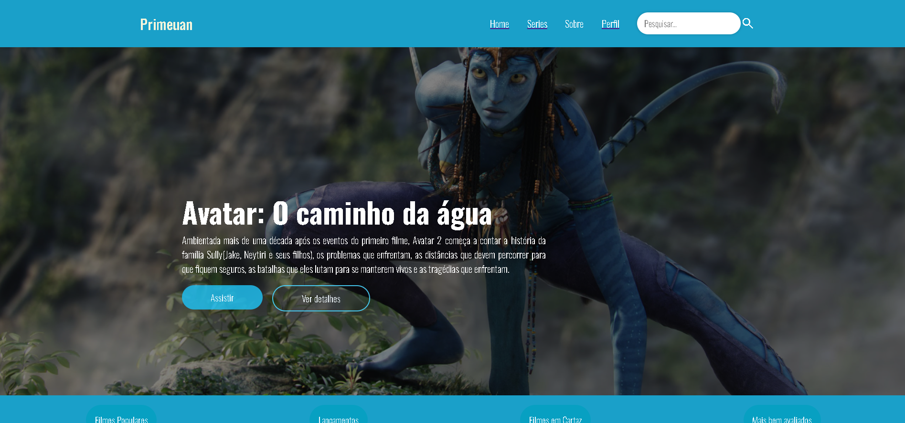
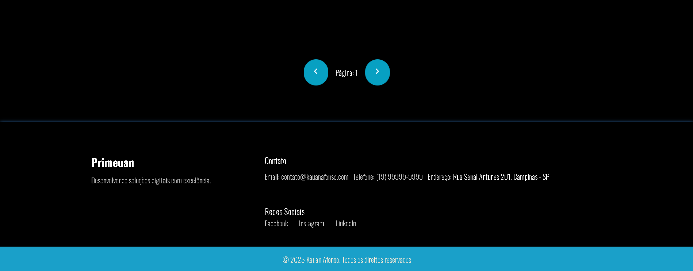
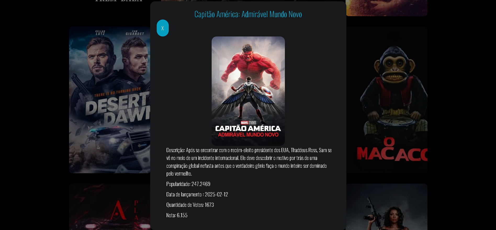

# 🎬 Primeuan - Catálogo de Filmes - SENAI

Projeto desenvolvido em React, consumindo a API do **BD Movies** para exibir um catálogo de filmes.

## 🔍 Sobre o Projeto

O **Primeuan** é uma aplicação web que exibe uma lista de filmes, permitindo aos usuários explorar os títulos disponíveis de forma rápida e intuitiva. A interface foi construída com **React** e consome dados da **API BD Movies**.

## 🚀 Tecnologias Utilizadas

- React
- JavaScript (ES6+)
- Axios (para requisições HTTP)
- CSS (ou styled-components, se aplicável)

## 📸 Imagem do Projeto

### Inicio

### Filmes 

### Paginação e footer

### Modal sobre o filme


## 📦 Como Rodar o Projeto

1. Clone este repositório:
   ```bash
   git clone https://github.com/seu-usuario/primeuan.git
   ```

2. Entre em catalogo:
   ```bash
   cd catalogo
   ```

2. Instale as dependencias:
   ```bash
   npm install
   ```
2. Start o projeto e acesse em http://localhost:3000:
   ```bash
    npm start
   ```